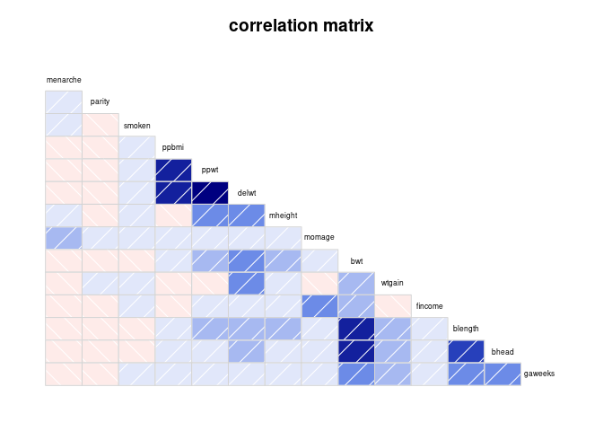
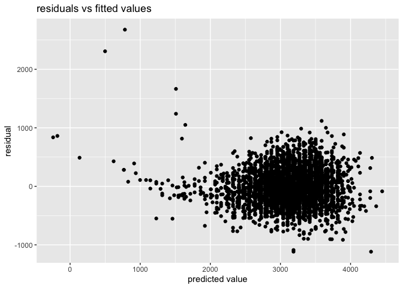
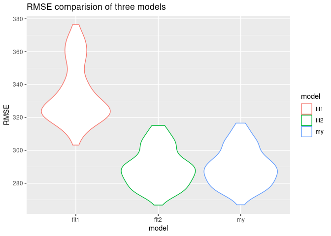
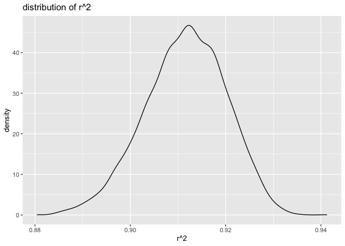
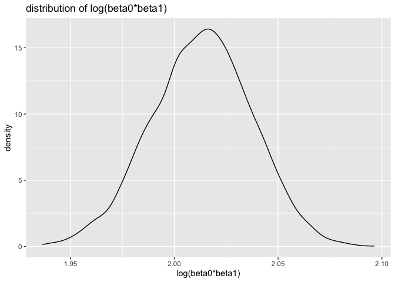

Homework6
================

## Problem 1

Load and clean the data for regression analysis

``` r
birthweight_df = read_csv("./birthweight.csv") %>%
  mutate(
    babysex = fct_recode(factor(babysex), male = "1", female = "2"),
    frace = fct_recode(factor(frace), White = "1", Black = "2", Asian = "3", Puerto_Rican = "4", Other = "8"),
    malform = fct_recode(factor(malform), absent = "0", present = "1"),
    mrace = fct_recode(factor(mrace), White = "1", Black = "2", Asian = "3", Puerto_Rican = "4"))%>%
  drop_na()
```

    ## 
    ## ── Column specification ────────────────────────────────────────────────────────
    ## cols(
    ##   .default = col_double()
    ## )
    ## ℹ Use `spec()` for the full column specifications.

Propose a regression model for birthweight. This model may be based on a
hypothesized structure for the factors that underly birthweight, on a
data-driven model-building process, or a combination of the two.
Describe your modeling process and show a plot of model residuals
against fitted values – use add\_predictions and add\_residuals in
making this plot.

``` r
birthweight_df %>%
  select(-babysex,-frace,-malform,-mrace,-pnumlbw,-pnumsga)%>%
  corrgram(order=TRUE, main="correlation matrix",upper.panel=NULL)
```

<!-- -->

We can see from the above correlation matrix that blength and bhead have
strong correlation with bwt. Therefore I propose the following model

``` r
my_fit = lm(bwt ~ blength + bhead, data = birthweight_df)
my_fit %>%   
  broom::tidy() %>% 
  knitr::kable()
```

| term        |    estimate | std.error |  statistic | p.value |
| :---------- | ----------: | --------: | ---------: | ------: |
| (Intercept) | \-6029.6197 | 95.821078 | \-62.92582 |       0 |
| blength     |     85.0302 |  2.076169 |   40.95534 |       0 |
| bhead       |    146.0207 |  3.489024 |   41.85146 |       0 |

``` r
birthweight_df %>% 
  add_residuals(my_fit) %>% 
  add_predictions(my_fit) %>% 
  ggplot(aes(x = pred, y = resid)) +
  geom_point() +
  labs(title = "residuals vs fitted values",
       x = "predicted value",
       y = "residual")
```

<!-- -->

Compare your model to two others Make this comparison in terms of the
cross-validated prediction error; use crossv\_mc and functions in purrr
as appropriate.

``` r
set.seed(3)
cv_df = 
  crossv_mc(birthweight_df, 100) %>% 
  mutate(train = map(train, as_tibble),test = map(test, as_tibble))%>%
  mutate(my_fit = map(train, ~lm(bwt ~ blength + bhead, data = .x)),
         fit1 = map(train, ~lm(bwt ~ blength + gaweeks, data = .x)),
         fit2 = map(train, ~lm(bwt ~ bhead + blength + babysex + bhead*blength + bhead*babysex + blength*babysex + bhead*blength*babysex, data = .x)))%>%
  mutate(rmse_my = map2_dbl(my_fit, test, ~rmse(model = .x, data = .y)),
         rmse_fit1 = map2_dbl(fit1, test, ~rmse(model = .x, data = .y)),
         rmse_fit2 = map2_dbl(fit2, test, ~rmse(model = .x, data = .y)))%>%
  select(starts_with("rmse")) %>% 
  pivot_longer(everything(),names_to = "model", values_to = "rmse",names_prefix = "rmse_")
 
  cv_df %>%
    ggplot(aes(x = model, y = rmse, color = model)) + geom_violin()+
    labs(title = "RMSE comparision of three models", x = "model",y = "RMSE")
```

<!-- -->

## Problem 2

``` r
weather_df = 
  rnoaa::meteo_pull_monitors(
    c("USW00094728"),
    var = c("PRCP", "TMIN", "TMAX"), 
    date_min = "2017-01-01",
    date_max = "2017-12-31") %>%
  mutate(
    name = recode(id, USW00094728 = "CentralPark_NY"),
    tmin = tmin / 10,
    tmax = tmax / 10) %>%
  select(name, id, everything())
```

    ## Registered S3 method overwritten by 'hoardr':
    ##   method           from
    ##   print.cache_info httr

    ## using cached file: ~/Library/Caches/R/noaa_ghcnd/USW00094728.dly

    ## date created (size, mb): 2021-12-04 15:21:42 (7.616)

    ## file min/max dates: 1869-01-01 / 2021-12-31

5000 bootstrap samples and, for each bootstrap sample, produce estimates
of these two quantities Plot the distribution of your estimates, and
describe these in words.

``` r
bootstrap_df = 
  weather_df %>% 
  bootstrap(n = 5000) %>%
  mutate(model = map(strap, ~lm(tmax ~ tmin, data = .x)),
         r_square = map(model, broom::glance),
         results = map(model, broom::tidy))%>%
  unnest(r_square) %>% 
  select(.id, r.squared, results) %>% 
  unnest(results) %>% 
  select(1:4)
r_square_df = bootstrap_df %>%
  select(.id, r.squared) %>%
  distinct()
r_square_df %>%
  ggplot(aes(x = r.squared)) +
  geom_density()+
  labs(title = "distribution of r^2",
       x = "r^2",
       y = "density")
```

<!-- -->

``` r
log_df =  bootstrap_df %>%
  select(.id, term, estimate) %>%
  mutate(term = recode(term, `(Intercept)` = "beta0_estimate", `tmin`="beta1_estimate"))%>%
  pivot_wider(names_from = "term",values_from = "estimate") %>%
  mutate(log_beta =log(beta0_estimate * beta1_estimate))
log_df %>%
  ggplot(aes(x = log_beta)) +
  geom_density()+
  labs(title = "distribution of log(beta0*beta1)",
       x = "log(beta0*beta1)",
       y = "density")
```

<!-- -->

Description: According to the above plots, the estimates of
\(\hat{r}^2\) is about 0.91 and of
\(log(\hat{\beta}_0 \ast \hat{\beta}_1)\) is close to 2.02

Using the 5000 bootstrap estimates, identify the 2.5% and 97.5%
quantiles to provide a 95% confidence interval

``` r
r_square_df %>%
  summarize(ci_lower = quantile(r.squared, 0.025), 
            ci_upper = quantile(r.squared, 0.975))
```

    ## # A tibble: 1 × 2
    ##   ci_lower ci_upper
    ##      <dbl>    <dbl>
    ## 1    0.894    0.927

``` r
log_df %>%
  summarize(ci_lower = quantile(log_beta, 0.025), 
            ci_upper = quantile(log_beta, 0.975))
```

    ## # A tibble: 1 × 2
    ##   ci_lower ci_upper
    ##      <dbl>    <dbl>
    ## 1     1.96     2.06
