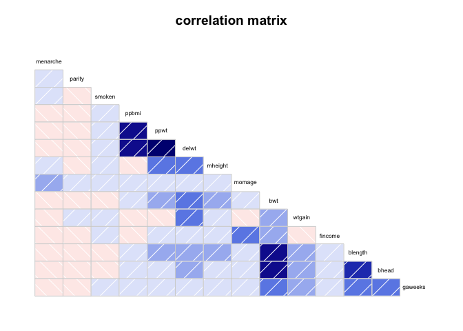
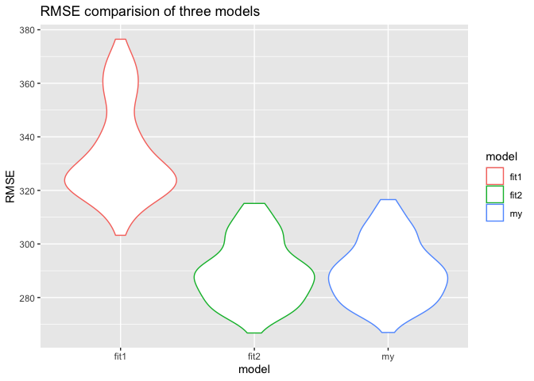

Homework6
================

## Problem 1

Load and clean the data for regression analysis

``` r
birthweight_df = read_csv("./birthweight.csv") %>%
  mutate(
    babysex = fct_recode(factor(babysex), male = "1", female = "2"),
    frace = fct_recode(factor(frace), White = "1", Black = "2", Asian = "3", Puerto_Rican = "4", Other = "8"),
    malform = fct_recode(factor(malform), absent = "0", present = "1"),
    mrace = fct_recode(factor(mrace), White = "1", Black = "2", Asian = "3", Puerto_Rican = "4"))%>%
  drop_na()
```

    ## Rows: 4342 Columns: 20

    ## ── Column specification ────────────────────────────────────────────────────────
    ## Delimiter: ","
    ## dbl (20): babysex, bhead, blength, bwt, delwt, fincome, frace, gaweeks, malf...

    ## 
    ## ℹ Use `spec()` to retrieve the full column specification for this data.
    ## ℹ Specify the column types or set `show_col_types = FALSE` to quiet this message.

Propose a regression model for birthweight. This model may be based on a
hypothesized structure for the factors that underly birthweight, on a
data-driven model-building process, or a combination of the two.
Describe your modeling process and show a plot of model residuals
against fitted values – use add_predictions and add_residuals in making
this plot.

``` r
birthweight_df %>%
  select(-babysex,-frace,-malform,-mrace,-pnumlbw,-pnumsga)%>%
  corrgram(order=TRUE, main="correlation matrix",upper.panel=NULL)
```

<!-- -->

We can see from the above correlation matrix that blength and bhead have
strong correlation with bwt. Therefore I propose the following model

``` r
my_fit = lm(bwt ~ blength + bhead, data = birthweight_df)
my_fit %>%   
  broom::tidy() %>% 
  knitr::kable()
```

| term        |   estimate | std.error | statistic | p.value |
|:------------|-----------:|----------:|----------:|--------:|
| (Intercept) | -6029.6197 | 95.821078 | -62.92582 |       0 |
| blength     |    85.0302 |  2.076169 |  40.95534 |       0 |
| bhead       |   146.0207 |  3.489024 |  41.85146 |       0 |

``` r
birthweight_df %>% 
  add_residuals(my_fit) %>% 
  add_predictions(my_fit) %>% 
  ggplot(aes(x = pred, y = resid)) +
  geom_point() +
  labs(title = "residuals vs fitted values",
       x = "predicted value",
       y = "residual")
```

<!-- -->

Compare your model to two others Make this comparison in terms of the
cross-validated prediction error; use crossv_mc and functions in purrr
as appropriate.

``` r
set.seed(3)
cv_df = 
  crossv_mc(birthweight_df, 100) %>% 
  mutate(train = map(train, as_tibble),test = map(test, as_tibble))%>%
  mutate(my_fit = map(train, ~lm(bwt ~ blength + bhead, data = .x)),
         fit1 = map(train, ~lm(bwt ~ blength + gaweeks, data = .x)),
         fit2 = map(train, ~lm(bwt ~ bhead + blength + babysex + bhead*blength + bhead*babysex + blength*babysex + bhead*blength*babysex, data = .x)))%>%
  mutate(rmse_my = map2_dbl(my_fit, test, ~rmse(model = .x, data = .y)),
         rmse_fit1 = map2_dbl(fit1, test, ~rmse(model = .x, data = .y)),
         rmse_fit2 = map2_dbl(fit2, test, ~rmse(model = .x, data = .y)))%>%
  select(starts_with("rmse")) %>% 
  pivot_longer(everything(),names_to = "model", values_to = "rmse",names_prefix = "rmse_")
 
  cv_df %>%
    ggplot(aes(x = model, y = rmse, color = model)) + geom_violin()+
    labs(title = "RMSE comparision of three models", x = "model",y = "RMSE")
```

<!-- -->

## Problem 2
